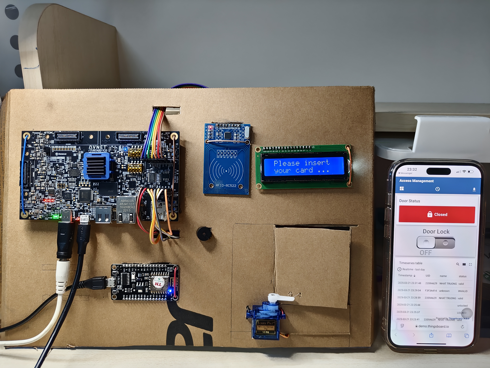
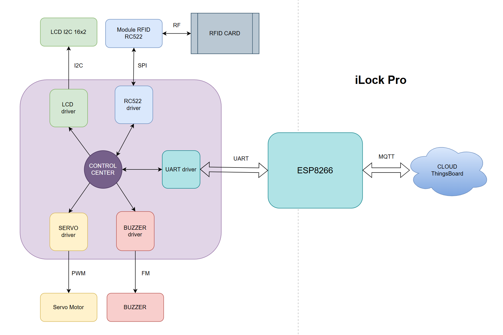

# iLock Pro

Project SEM2 - FPT jetking - CHIP DESIGN - Team H4T:
- Võ Nhật Trường
- Trần Ngọc Thắng
- Nguyễn Bách Thông
- Nguyễn Chí Tâm
- Đặng Hữu Thái Hòa

[Presentation on Canva](https://www.canva.com/design/DAGiRLCWRs0/Xcx-blfiineq--gKC0x6bA/edit)

## 1. Introduction
- Hệ thống kiểm soát truy cập bằng thẻ **RFID** thiết kế trên board FPGA (ZuBoard 1CG).
- Tích hợp nhiều giao thức truyền nhận dữ liệu:
  + FPGA <= (**UART**) => ESP8266
  + FPGA <= (**I2C**) => LCD
  + FPGA <= (**SPI**) => RC522
  + FPGA <= (**PWM**) => Servo Motor
  + FPGA <= (**FM**) => Buzzer
- Chức năng nổi bật:
  + Kiểm soát truy cập bằng thẻ RFID.
  + Tự động Lock hệ thống khi quét thẻ sai 3 lần.
  + Điều khiển qua Cloud ThingsBoard: lưu dấu lịch sử, Lock hoặc Unlock hệ thống.
 
## 2. Demo

[Demo on Youtube](https://www.youtube.com/watch?v=19893c4RlUE)

## 3. Hardware schematic

## 4. Block Diagram

## 5. Block Diagram - top module

## 6. ThingsBoard UI

[Dashboard Thingsboard](https://demo.thingsboard.io/dashboard/6c5fe6d0-f7cf-11ef-9dbc-834dadad7dd9?publicId=76892100-edfa-11ef-9dbc-834dadad7dd9)

## 7. Flowchart

## 8. References
1. [https://github.com/truong92cdv/VERILOG_lcd_i2c](https://github.com/truong92cdv/VERILOG_lcd_i2c)
2. [https://github.com/truong92cdv/VERILOG_rc522](https://github.com/truong92cdv/VERILOG_rc522)
3. [https://github.com/truong92cdv/VERILOG_buzzer](https://github.com/truong92cdv/VERILOG_buzzer)
4. [https://github.com/truong92cdv/UART_fpga_esp32](https://github.com/truong92cdv/UART_fpga_esp32)
